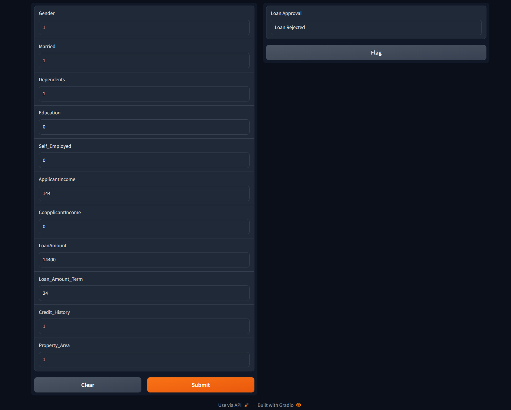

# 💰 Loan Approval Prediction System

[](LICENSE)

An intelligent machine learning application that predicts loan approval using trained classification models. With an interactive Gradio interface, users can input loan applicant details and receive fast, reliable predictions—making the loan approval process more efficient and transparent.

---

## 📌 Key Features

- 🧠 Trained on Logistic Regression, Random Forest, K-Nearest Neighbors (KNN), and Support Vector Machine (SVM)
- 📊 Achieved 85% accuracy on test data
- 🎯 Precision: 90%, Recall: 88%
- 🖼️ Simple Gradio interface for user interaction
- 📂 Upload CSVs or manually input data
- 📤 Download flagged results or prediction outputs

---

## 🛠️ Tech Stack

### Languages & Libraries:


---

## 📁 Project Structure

| File/Folder                     | Description                                       |
|--------------------------------|---------------------------------------------------|
| `Loan Approval Prediction.ipynb` | Jupyter Notebook with model training and testing |
| `LoanApprovalPrediction.csv`   | Sample dataset used for training/testing          |
| `knn_model.pkl`                | K-Nearest Neighbors trained model                 |
| `lc_model.pkl`                 | Logistic Regression trained model                 |
| `rfc_model.pkl`                | Random Forest Classifier trained model            |
| `svc_model.pkl`                | Support Vector Classifier trained model           |
| `Gradio.png`                   | Interface screenshot                              |
| `flagged/`                     | Directory for storing Gradio-flagged inputs       |

---

## 🚀 How to Run

1. **Clone the repository:**
   ```bash
   git clone https://github.com/rog-mithun/Loan-Approval-Prediction.git
   cd Loan-Approval-Prediction

2. **Install dependencies:**
   ```bash
   pip install -r requirements.txt

3. **Launch the app:**
   
   Open Loan Approval Prediction.ipynb in Jupyter Notebook or Colab and Run.

---

## 🧪 Sample Input

-[Input](LoanApprovalPrediction.csv)

---

## 📂 Demo Preview

-

---

📖 License

This project is licensed under the MIT License © 2022 Mithunsankar S.
